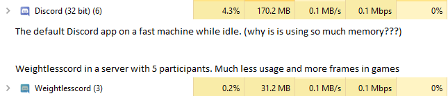
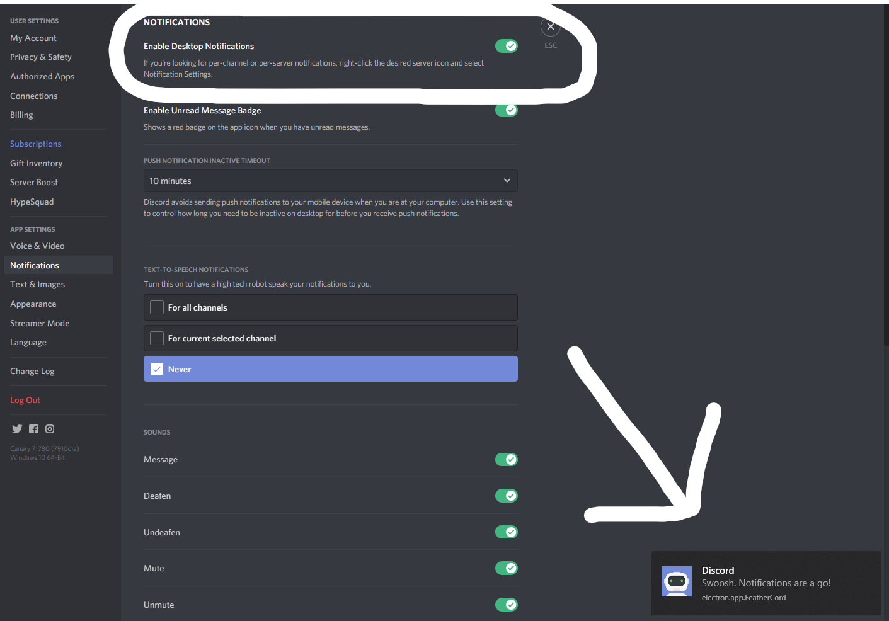

# FeatherCord

FeatherCord is a lightweight alternative to the Discord client and uses up to 25% less resources compared to the default desktop client
FeatherCord is Availible for Windows as well as native MacOS (With M1 support & Linux binaries coming soon)

dont believe me... well take a look at what someone else said about FeatherCord

# Notifications
Notifications are supported but arent enabled by default. head here to turn them on 

# Known Issues
* Screen Sharing does not work (Limitation of discord webapp)
